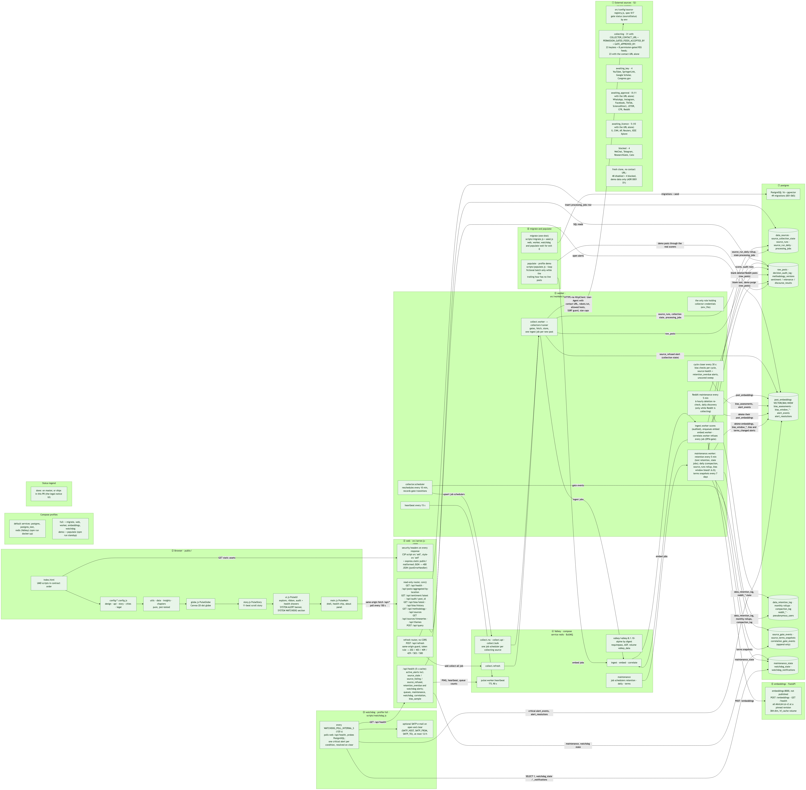

# Pulse of AI

**How the world talks about AI, city by city, with every score traceable to the model that made it.**

Pulse of AI collects public, AI-related posts from a registry of 52 global online sources in 8 categories (social, news, academic, policy, non-profit, developer, forums, blogs). It scores each post for sentiment, AI relevance and discourse quality, checks the results for bias, and shows the trailing hour on a scroll-driven dot globe: an eleven-part guided story, then a free-explore mode. Every score has an audit receipt ("why?") that names the model, its registered methodology version and settings, and explains the decision for four audiences.

---

## Contents

- [Status and scope](#status-and-scope)
- [Quick start](#quick-start)
- [Turning on live collection](#turning-on-live-collection)
- [Live and demo data](#live-and-demo-data)
- [Alerting](#alerting)
- [Architecture](#architecture)
- [API](#api)
- [Development](#development)
- [Testing](#testing)
- [Security and privacy](#security-and-privacy)
- [Responsible-AI audit trail](#responsible-ai-audit-trail)
- [Project documents](#project-documents)
- [Contributing](#contributing)
- [License](#license)

---

## Status and scope

What works today, stated plainly:

- **The registry has 52 sources** (`src/config/source-registry.js`, which matches the workbook of record `docs/requirements/Top_50_Global_Online_Sources.xlsx` (Rev. 4, exported as `docs/requirements/Top_52_Global_Online_Sources.rev4.csv`), ADR 0001). Each resolves at runtime to a gate status: `collecting`, `awaiting_key`, `awaiting_approval`, `awaiting_licence`, `blocked` or `disabled`.
- **Live collection is off on a fresh clone.** Without `COLLECTOR_CONTACT_URL` every source is `disabled` except the 4 `blocked` ones, which report `blocked` until they can collect, which takes an official permission, the contact URL and a named approval (`GATE_APPROVED_BY`). A kill switch reports them `disabled`, and so does a recorded permission without the contact URL. The page runs on clearly labelled demo data. See [Turning on live collection](#turning-on-live-collection).
- **With the contact URL set, 23 sources collect with no keys.** With the contact URL, the operator acknowledgement for the 8 permission-gated news feeds and a named approval (`GATE_APPROVED_BY`, decision G5), **31 collect**. The other 21 wait for something only their operator can provide, and every one of them also needs the named approval to open:

  | Status | Count | Sources | What opens them |
  |---|---|---|---|
  | awaiting_key | 4 | YouTube, SpringerLink, Google Scholar (alert mailbox), Congress.gov | a free self-service key |
  | awaiting_approval | 8 | WhatsApp, Instagram, Facebook (Meta Content Library), TikTok Research API, ScienceDirect, JSTOR, CFR, Reddit | a researcher-program or publisher approval |
  | awaiting_licence | 5 | X, CNN, AP, Reuters, IEEE Xplore | a paid licence |
  | blocked | 4 | WeChat, Telegram, ResearchGate, Cato | no compliant access today; each has a collector that refuses to run without an official permission |

- **Reddit (#52) is built but awaiting approval.** It uses only the approved Reddit Data API and stays closed until Reddit approves the app and all four `REDDIT_*` variables are set. Reddit post text is blanked 48 hours after collection, or sooner when the 6-hourly re-check finds the post deleted or removed upstream, while its scores and audit rows are kept (ADR 0001 rulings 8 and 9).
- **Demo data is always labelled.** When the trailing hour has no live posts, fictional demo posts go through the real pipeline and the page says DEMO (details in [Live and demo data](#live-and-demo-data)).
- **Maintenance runs on its own.** The worker removes post text past its source's window every 5 minutes (Reddit 48 h; every other source, the Guardian included, the 90-day detail window, except YouTube and TikTok at 30 days), and once a day compacts whole months past the detail window into rollups, rolls up run history and runs the bias checks over a rolling 24 h window. Processing-job records are kept permanently.
- **Alerting runs outside the worker.** The `watchdog` service raises critical alerts on the dashboard, and by e-mail when SMTP is configured, when the web API, the database, Valkey, the worker or maintenance fail (see [Alerting](#alerting)).

---

## Quick start

One command builds and starts the whole solution (frontend, API, worker, embeddings service, databases), fills it with data and checks that it works:

```bash
git clone https://github.com/jennifer-mckinney/pulse-of-ai.git
cd pulse-of-ai
npm run standup          # or: bash scripts/standup.sh
```

When it finishes, open **http://localhost:3000**: the globe, the eleven chapters with their numbers, and a "why?" receipt on any post that opens its real audit trail.

### Prerequisites

- **Docker Compose 2.39.0 or newer** (`docker compose version`) with Docker Desktop (macOS / Windows) or Docker Engine (Linux), and the daemon running. `docker-compose.yml` uses `build.provenance` / `build.sbom`, which Compose added in 2.39.0; standup checks the version and stops with upgrade instructions if it is older.
- **Bash 3.2 or newer.** macOS `/bin/bash` and any Linux bash work. On **Windows**, run it from **WSL 2** (recommended, with Docker Desktop's WSL integration on) or **Git Bash**. PowerShell and `cmd.exe` cannot run the script: `npm run standup` from them works only when one of those `bash` executables is on `PATH`. Under Git Bash, NTFS does not enforce the `chmod 600` standup applies to `.env`, so restrict that file with Windows permissions yourself.
- **Node.js and npm, for the `npm run` wrapper only.** `npm run standup` just launches `bash scripts/standup.sh`; no `npm install` is needed, and `bash scripts/standup.sh` works without Node at all. Node and Python run only inside the containers.
- `curl`, plus `awk`, `sed`, `grep`, `find` and `openssl` (or `/dev/urandom` with `od`), which every macOS, Linux, WSL and Git Bash install has.

### What standup does

1. Creates `.env` from `.env.example` if you don't have one, generating strong random `POSTGRES_PASSWORD`, `REDIS_PASSWORD`, `AUDIT_HASH_KEY` and `CORRELATION_SALT` values. It never prints them. An existing `.env` keeps its values: only missing keys are added (standup refuses to add secrets to a group- or world-writable file), and the file is set to mode 600. If a secret is empty or still has its `.env.example` placeholder, standup stops and names it. Run on a terminal, it offers to set the two collection settings described below.
2. Builds two images: `pulse-of-ai/app` (Node 22; one image for web, worker, watchdog, migrate and populate) and `pulse-of-ai/embeddings` (Python 3.13, FastAPI and sentence-transformers, CPU only). Both run as non-root users.
3. Starts the compose `full` profile. A one-shot `migrate` job applies the 50 migrations (001–066; the numbering has gaps) and the seed; web, the worker and the watchdog (and populate, in the demo profile) start only after it exits successfully.
4. Waits for health, with timeouts, and prints a failing service's logs.
5. Populates data: one real collection run, then demo data only if the trailing hour has no live posts, and starts the `populate` demo-fallback service.
6. Runs a smoke check: the API, the page and the page's own data calls, population counts, the worker heartbeat, one receipt with its four audience views and bias lineage, and `npm run replay` on that post, which must PASS. It ends with a population summary that labels the trailing hour LIVE, MIXED, DEMO or NONE (NO DATA when nothing is stored at all).

Re-running is safe: images come from the build cache, running containers are kept, and a second demo batch is skipped while the trailing hour is full. Flags: `npm run standup -- --help`. `--yes` never prompts, `--no-build` skips the image build, `--demo` adds a fresh demo batch. Timeouts: `STANDUP_TIMEOUT` (core services, default 300 s) and `STANDUP_EMBEDDINGS_TIMEOUT` (first model download, default 900 s).

The first start downloads the ~90 MB `all-MiniLM-L6-v2` model into the `hf_cache` volume. If that fails (offline, proxy), standup says so and carries on: posts are still scored and audited, but they get no embeddings. Fix the network and run standup again: the re-run backfills embeddings for the trailing hour's demo posts; live posts collected while the service was down stay without one.

### What runs where

| Service | Host port (override) | Role |
|---|---|---|
| `web` | `3000` (`WEB_PORT`) | Express API and the static frontend (`public/`) |
| `worker` | none | Collection scheduler and `collect.{rss,api,bulk}` consumers, refresh collections, scoring (the `ingest` queue), cycle close and bias checks, embed jobs, the `maintenance` schedules (retention, compaction, run rollups, the rolling bias window, terms snapshots) and Reddit maintenance (`src/workers/start.js`). The only role holding collector credentials: it loads the env file (`PULSE_ENV_FILE`, default `.env`) whole through Compose `env_file`, while web gets only a "set" marker per credential. Healthy while its heartbeat is fresh; `docker stop` gives it 180 s to finish in-flight jobs |
| `embeddings` | none (compose network only, `embeddings:8000`) | `POST /embeddings` and `GET /health`, unauthenticated, so never published |
| `watchdog` | none | External alerting (see [Alerting](#alerting)). Polls `/api/health` every 2 minutes from its own container, so it still alerts when the worker is dead; writes critical alerts to the database and e-mails them. Holds only the database password and the SMTP settings; the only role that gets `SMTP_PASSWORD` |
| `populate` | none | Demo feed (profile `demo`): stores and scores a fictional batch every 150 s, only while the trailing hour has no live posts (not the page's bundled fallback) |
| `migrate` | none | One-shot: migrations and seed |
| `postgres` | `POSTGRES_PORT` (`5434` in `.env.example`; `5432` if unset) | PostgreSQL 16 + pgvector (`postgres_data` volume) |
| `postgres_test` | `5433` (`POSTGRES_TEST_PORT`) | Test database, not used by the running app |
| `redis` | `6379` (`REDIS_PORT`) | Valkey 8, the BullMQ queue backend and the worker heartbeat (`valkey_data` volume). It speaks the Redis protocol, so the service name and the `REDIS_*` variables keep that name. Password required (`REDIS_PASSWORD`) |

Every published port binds to `127.0.0.1` by default (`PULSE_BIND_ADDR`). Setting `PULSE_BIND_ADDR=0.0.0.0` exposes all of them to your network, databases included. `GET /api/health` reports `redis.reachable` and `worker.alive`, the `watchdog` service polls it and alerts when something is wrong, and every container's logs rotate (json-file, 5 × 10 MB). The worker's `env_file` uses the long syntax with `required: true` (Compose 2.24 or newer, covered by the 2.39.0 minimum): a missing `.env`, or a wrong `PULSE_ENV_FILE`, stops `docker compose --profile full up` with "env file … not found" instead of starting a worker whose keyed sources are all silently closed.

To run a second stack beside this one, give it its own project name and ports:

```bash
COMPOSE_PROJECT_NAME=pulse-demo WEB_PORT=3200 \
POSTGRES_PORT=5534 POSTGRES_TEST_PORT=5533 REDIS_PORT=6479 npm run standup
```

### Tear it down

```bash
npm run teardown                    # stop and remove containers, keep the data volumes
npm run teardown -- --purge         # also delete the volumes (database, Valkey, model cache); asks first
npm run teardown -- --purge --yes   # non-interactive purge
bash scripts/teardown.sh --purge    # the same without Node.js/npm on the host
```

Teardown acts on one compose project: `COMPOSE_PROJECT_NAME` if set, otherwise the one in `.env`, otherwise `pulse-of-ai`, and says which. If the name comes from your shell and differs from `.env`, it asks you to type it before stopping anything. Orphan containers are left alone. Tearing down `pulse-of-ai` also stops `postgres_test` (port 5433), which the jest suite uses, and teardown warns first.

### Upgrading an existing database

**Take a `pg_dump` before the first worker start after upgrading.** The worker's maintenance job runs as soon as it starts: it permanently removes post text past each source's window (a platform's terms where they set one, such as Reddit's 48 h; otherwise the 90-day detail window, `RETENTION_DETAIL_DAYS`) and compacts every whole month older than that into rollups. On a database that has not run it before, that is all old data at once, and it cannot be undone. Back up first, before `npm run standup` (or before starting the worker by hand): `docker compose up -d postgres`, then `docker compose exec postgres pg_dump -U pulse_user pulse_of_ai > backup-before-upgrade.sql`.

Standup applies pending migrations and the idempotent seed on every run. For host-side development, run `npm run migrate && npm run seed` after pulling. Migrations are forward-only; take a backup first if you may need to go back: `docker compose exec postgres pg_dump -U pulse_user pulse_of_ai > backup.sql`. Postgres reads `POSTGRES_PASSWORD` only when it first creates the database, so to change it on an existing volume run `\password pulse_user` in `docker compose exec postgres psql -U pulse_user -d pulse_of_ai` and put the same value in `.env` (or start over with `npm run teardown -- --purge`, which deletes the data).

**Upgrading a stack that ran Redis 7.** The queue store is now Valkey 8 on a new `valkey_data` volume. Redis 7.4 writes RDB format 12, which Valkey 8 will not load, so the old `redis_data` volume is left unused rather than reused. Schedules need no migrating: the worker re-registers every schedule when it starts. Jobs still queued at the switch are dropped, though, and a later collection does not fetch their items again (stored posts are deduplicated):

1. **Drain first.** Switch collection off with the database kill switch for each collecting source (`npm run source:disable -- <slug> --reason "valkey upgrade"`; undo with `source:enable` afterwards), then wait until `GET /api/health` shows `worker.queues.ingest` and `worker.queues.embed` with 0 waiting, active and delayed.
2. **Upgrade within 24 hours of the last collection.** Dropped scoring jobs are recovered only by the unscored-post sweep, which looks back 24 hours; their collection cycles close at the 15-minute hard cap. Dropped embed jobs are not recovered at all.
3. Stop the stack cleanly (`docker stop` gives the worker 180 s to finish in-flight jobs), bring it back up, and once it is healthy remove the old volume with `docker volume rm <project>_redis_data`.

---

## Turning on live collection

Collection goes out under the operator's identity, so each operator makes these choices themselves (ADR 0001, decision D1 "Off for others, on for you"). Both values go in your `.env`, never in `.env.example` or the compose file:

```bash
# A page where publishers can reach YOU (your repository or a contact page).
# It goes into every request's User-Agent. Without it every source is disabled.
COLLECTOR_CONTACT_URL=https://github.com/<you>/pulse-of-ai

# Optional. Opens the 8 permission-gated news feeds (BBC, NYT, Guardian,
# Al Jazeera, WSJ, NBC News, Washington Post, Ars Technica). Their RSS is
# public, but their terms require permission for automated analysis; setting
# this records that YOU accept that legal risk.
PERMISSION_GATED_FEEDS_ACCEPTED_BY="<your name> <YYYY-MM-DD>"

# Needed to open ANY gated source: one that needs a key, an approval
# reference, a licence or the acknowledgement above (decision G5).
GATE_APPROVED_BY="<name> <YYYY-MM-DD>"
```

Run interactively, `npm run standup` asks for the first two; `--yes` never asks. Standup never asks for `GATE_APPROVED_BY` or fills it in: set it by hand in `.env`.

**Every gated source needs a named approval** (ADR 0001, decision G5). A source that needs a key, an approval reference, a licence or the acknowledgement above opens only when `GATE_APPROVED_BY` names the person who approved opening it (a name, then a real date). Until then it stays closed with the status reason "awaiting named approval"; keyless sources are unaffected. The value is recorded as the approver of every gate opening in the append-only `source_gate_events` table, and `npm run source:disable | enable | reset` refuse to run without it (it is their recorded actor, not your shell's `$USER`).

With the contact URL set, 23 sources collect, whether or not the acknowledgement is set. With the contact URL, the acknowledgement and `GATE_APPROVED_BY`, 31 collect. A key, approval reference or licence you add later opens its source only while `GATE_APPROVED_BY` is set. `.env.example` lists every source key and where to get it, and documents the per-source kill switch `SOURCE_<SLUG>_ENABLED=false` (slugs are in `src/config/source-registry.js`).

After changing `.env`, recreate the containers (`docker compose up -d worker web`; `docker restart` does not re-read `.env`). To stop a source at once without touching env:

```bash
npm run source:disable -- <slug> --reason "<why>"   # database kill switch, every process, before the next run
npm run source:enable  -- <slug>
npm run source:reset   -- <slug> --note "<why>"     # clear the refused state and its 24 h probation after a 401/403/451 or robots refusal
```

All three need `GATE_APPROVED_BY` set, and record it as the actor.

Env kill switches also exist: `SOURCE_<SLUG>_ENABLED=false`, `COLLECTORS_DISABLED=slug1,slug2`, and the global `COLLECTORS_ENABLED=false`.

Collection runs in the worker: each collecting source on its own schedule, every 150 s by default (`COLLECT_WINDOW_MS`), stretched where a documented rate limit needs it (and to 180 s for TLDR, which answered 150 s polls with HTTP 429). `POST /api/refresh` asks the worker for one collection over every source (see [API](#api)). `npm run collect` runs one collection job by hand; `npm run collect:smoke` fetches every enabled keyless route once and writes nothing.

### Adding a keyed source (a supervised first run)

A source whose key, licence or approval arrives later is not scheduled blind (PR #10 review P10-17):

1. Keep the new credential out of `.env` for now, and run a supervised dry run of that one source. **Never type a key on the command line** (a `NAME=value` prefix in front of a command): the whole line is saved in your shell history (`~/.zsh_history`, `~/.bash_history`), which persists, is often backed up or synced, and is outside every log-scrubbing control. Use one of these instead:
   - Prompt for it. `read -rs` does not echo the key and nothing reaches the history; unset it afterwards:
     ```bash
     read -rs -p 'Guardian API key: ' GUARDIAN_API_KEY; echo; export GUARDIAN_API_KEY
     read -r -p 'Guardian licence reference: ' GUARDIAN_COMMERCIAL_LICENSE_REF; export GUARDIAN_COMMERCIAL_LICENSE_REF
     npm run collect -- --supervised --only guardian
     unset GUARDIAN_API_KEY GUARDIAN_COMMERCIAL_LICENSE_REF
     ```
     (In zsh, `read -rs` takes the prompt as `read -rs 'GUARDIAN_API_KEY?Guardian API key: '`.)
   - Or write it with an editor into a private env file outside the repository, readable only by you, load it for this one run, then delete it:
     ```bash
     umask 077 && "${EDITOR:-vi}" ~/guardian-trial.env        # GUARDIAN_API_KEY=… and GUARDIAN_COMMERCIAL_LICENSE_REF=…
     node --env-file="$HOME/guardian-trial.env" scripts/collect.js --supervised --only guardian
     rm ~/guardian-trial.env
     ```
   The dry run opens the source only if it would collect under that environment, so `COLLECTOR_CONTACT_URL` and `GATE_APPROVED_BY` must already be set in `.env`; otherwise it stops and prints the source's status.
2. It fetches every open route through the real collectors (robots, allowed hosts, quotas and redaction all apply), prints what each route returned and a sample of up to 5 payloads exactly as they would be stored, and stores nothing: no posts, scores, cursors, collection state or job. Its only database access is one read of the source's kill switch and refusal state: a source disabled with `npm run source:disable` or still in its refusal cooldown is refused before any request, exactly as the worker would refuse it.
3. Sign off if the sample is on topic and carries no personal data beyond the ingest claim. Then add the credential to `.env` and recreate the containers (`docker compose up -d worker web`); the worker schedules the source on its next reschedule.

---

## Live and demo data

Demo data is only the fallback, used when collection yields nothing in the trailing hour (offline, collection off, or every source failing). It is honest about what it is:

- **Real pipeline, fictional input.** The posts are invented text with no people, handles or personal data. They go through the real ingest normaliser, the real sentiment, relevance and discourse scorers, the real bias checks and, when the embeddings service is ready, the real embed worker (a run that finds it not ready skips embedding, and a later standup re-run backfills the trailing hour's demo embeddings). Every score has a genuine audit trail, and `npm run replay -- --post <id>` reports PASS.
- **Labelled in the data.** Demo posts belong to inactive `demo_<category>` sources named "Demo feed — <Category> (fictional)", their text starts with `[Demo]`, and their jobs are recorded as `triggered_by = 'demo'`.
- **Real timestamps.** Each demo post carries the time it was actually ingested; nothing is backdated. The `populate` service adds `DEMO_FEED_BATCH` posts (default 16, two per category) every `DEMO_FEED_INTERVAL_MS` (default 150 s) while the hour has no live posts; stop it and demo posts age out.
- **Shown as DEMO on the page.** `GET /api/health` reports `data_mode` (`live`, `demo`, `mixed` or `none`) for exactly what the globe shows, every row of `GET /api/posts/aggregated-by-location` (the globe's city aggregation) carries `demo_posts` / `data_mode`, and every receipt carries `data_origin`. With demo data the intro kicker reads DEMO, chapter titles carry a "— Demo data" marker, and receipts say the post is fictional demo content.

The health drawer counts demo feeds separately from the 52 registry sources.

---

## Alerting

Every other alert (freshness, retention, bias) is evaluated inside the worker, so a dead worker would stop them all. The `watchdog` service (`scripts/watchdog.js`, `src/watchdog/`) runs in its own container in the `full` profile. Every `WATCHDOG_POLL_INTERVAL_S` (default 120 s, first poll 60 s after start) it reads `GET /api/health`, probes PostgreSQL itself, and raises a **critical** alert for each of these conditions:

| Condition | Raised when |
|---|---|
| Web API unreachable | `/api/health` does not answer (refused, timeout, 5xx) |
| Database unreachable | the watchdog's own `SELECT 1` fails, or health reports `db_connected: false` |
| Valkey unreachable | health reports `redis.reachable: false` |
| Worker down | Valkey answers but the worker heartbeat is missing or older than 90 s |
| Maintenance failing or overdue | a maintenance task's latest run failed, or its last success is older than 30 min (retention), 26 h (daily: compaction, run rollups and the rolling 24 h bias window) or 8 days (terms) |
| Text retention overdue | text is stored past its retention window, or the window setting is invalid |
| Collection failing | sources are enabled but none collected successfully in the last hour |
| Queue backlog abnormal | a queue holds more than 5000 waiting + delayed jobs |
| Failed jobs abnormal | more than 25 queue jobs failed in the last hour, or more than 3 collection cycles |

What happens when a condition appears:

- **Dashboard.** One critical alert row per condition (the database allows only one open), shown as a red **SYSTEM ALERT** on the header health chip and at the top of the health drawer, with its summary. The drawer's SYSTEM WATCHDOG section says whether the watchdog is reporting and whether e-mail is on. When the condition clears, the alert is resolved with an audited `alert_resolutions` record.
- **E-mail.** One message when the condition opens and one when it clears, never one per poll. At most `WATCHDOG_EMAIL_MAX_PER_HOUR` (12) messages an hour; a failed send is retried on the next polls. Every decision is logged in `watchdog_notifications`.
- **The watchdog never crash-loops.** The API or the database being down is itself a condition; it keeps polling and clears the alert when they return. A condition that opened and cleared while the database was down is recorded afterwards as an already-resolved alert.

**Configuring e-mail.** Add the SMTP settings to `.env` (see `.env.example`, "Alerting"), then recreate the watchdog with `docker compose --profile full up -d watchdog`:

```bash
SMTP_HOST=smtp.example.org
SMTP_PORT=587            # empty: 587, or 465 with SMTP_SECURE=true
SMTP_SECURE=false        # true = TLS from the first byte (465)
SMTP_REQUIRE_TLS=true    # with SMTP_SECURE=false, STARTTLS is required unless this is false
SMTP_USER=alerts@example.org
SMTP_PASSWORD=           # edit .env with an editor; never type it on a command line (shell history)
SMTP_FROM="Pulse of AI <alerts@example.org>"
SMTP_TO=you@example.org,oncall@example.org
WATCHDOG_DASHBOARD_URL=http://localhost:3000   # optional link in the e-mails
```

E-mail is on when `SMTP_HOST`, `SMTP_FROM` and `SMTP_TO` are all set. Without them the watchdog alerts on the dashboard only, and `/api/health` (`watchdog.email.status`) and the health drawer say **"email alerting not configured"**. Incomplete or invalid settings are named there too. The SMTP password reaches the `watchdog` container only: web never gets it, and the worker, which loads `.env` whole, has it blanked (`scripts/test/check-compose.sh` enforces both). Test your settings by stopping the worker for a few minutes (`docker compose --profile full stop worker`, then `start worker`): you should get a CRITICAL and then a CLEARED e-mail. The thresholds are in `.env.example`; `docker compose --profile full logs watchdog` shows every poll.

---

## Architecture



- **Browser** (`public/`, no build step, all assets self-hosted): UMD modules loaded in a fixed order. `globe.js` draws a Canvas-2D dot globe, `story.js` runs the eleven-part scroll story, `ui.js` provides explore mode, the source ribbon and the audit and health drawers, `main.js` is the page shell, and `credits.html` (with `credits.js`) is the credits page that the header "credits" chip opens.
- **web** (`src/server.js`): Express serves the page and the API.
- **worker** (`src/workers/start.js`): collection, scoring (the `ingest` queue), cycle close and bias checks, source-health alerts, embeddings, the maintenance schedules (text retention, compaction, the rolling bias window, terms snapshots) and Reddit maintenance, over BullMQ queues in Valkey 8.
- **watchdog** (`scripts/watchdog.js`, `src/watchdog/`): external alerting from its own container (see [Alerting](#alerting)).
- **Collectors** (`src/collectors/`): one base class per access type (RSS/Atom, JSON API, bulk file) and an adapter per source route. Every HTTP request goes through one guarded HTTP client; bulk-file routes read operator-supplied files and Google Scholar reads its alert mailbox over IMAP.
- **Pipeline** (`src/pipeline/`): sentiment (AFINN), relevance (a 21-term lexicon matched as whole words), discourse quality (a DQI heuristic) and job-level bias checks, each versioned in `methodology_versions`.
- **embeddings** (`python/embeddings_service.py`): FastAPI + sentence-transformers, `all-MiniLM-L6-v2` at a pinned revision, 384-dimension vectors stored with pgvector.
- **PostgreSQL 16 + pgvector**: 50 migrations in `src/db/migrations/` (001–066, with gaps), 34 tables.

The full diagram set (twenty-one diagrams: deployment, trust boundaries, the collection cycle in three parts, data flows, four ERDs, class diagrams, sequences and state diagrams) is indexed in **[docs/diagrams/README.md](docs/diagrams/README.md)**, with each diagram's source files and the notes where the spec and the code differ.

---

## API

All endpoints are under `/api`. The read-only endpoints send CORS headers; `POST /api/refresh` does not.

| Method | Path | Returns |
|---|---|---|
| `GET` | `/api/health` | Status, DB connection, last job, unresolved alerts, `data_mode` and `data_window` for the trailing hour, source counts by status, Valkey reachability, the worker heartbeat and queue counts, maintenance, watchdog, bias-sample and correlation-gate status (cached 5 s) |
| `GET` | `/api/posts/aggregated-by-location` | Sentiment counts per city with coordinates and data origin (`?platform=`, `?from=`, `?to=`) |
| `GET` | `/api/sentiment/latest` | Sentiment summary and recent posts, each with its source credit and link back (`?limit=` up to 100, `?platform=`) |
| `GET` | `/api/themes` | Up to 12 keyword themes with their sentiment split and top category |
| `POST` | `/api/query` | Filtered scored posts with source attribution, credit and link back: the newest `limit` matches (up to 100) and the `total` match count; no offset (body: `platform`, `location`, `from`, `to`, `limit`) |
| `GET` | `/api/audit/:post_id` | The receipt: provenance, post (with its credit and link back), every decision with four audience views, the ingestion step and the bias layers |
| `GET` | `/api/bias/latest` | The latest job's bias assessments and violations, and the share of "insufficient sample" assessments per check |
| `GET` | `/api/bias/history` | Bias alert history for a window (`?hours=`, default 12, 1–48) with methodology lineage |
| `GET` | `/api/methodology` | Every registered methodology version with its config and justification |
| `GET` | `/api/sources` | The 52 registry sources with runtime status, terms, attribution and last-run classification (`?include_inactive=true` adds demo feeds and retired rows) |
| `GET` | `/api/credits` | The credit, licence and notice of every registry source that has stored real posts, and the site-wide notices the credits page shows (cached 60 s) |
| `GET` | `/api/sources/timeseries` | Hourly sentiment volume per category (`?hours=`, default 12, 1–48) |
| `POST` | `/api/refresh` | Asks the worker for one collection over every source: 202 with a `job_id`; 403 cross-site, without a valid `X-Refresh-Token` once `REFRESH_TOKEN` is set, or with no `REFRESH_TOKEN` when the site is bound beyond loopback or reached through a proxy; 409 while one runs; 429 within 60 s of the last; 503 if the queue is down; 500 on an unexpected error |

**Credits and links back.** Every post row of `/api/query`, `/api/sentiment/latest` and `/api/audit/:post_id` carries `credit`, `source_url`, `published_at` and `data_origin` next to the existing `attribution`, and the page shows a credit line under each excerpt ("via NPR · npr.org"), with the licence link, a "shortened and redacted" note, the Pew citation date or the arXiv and NCBI notices where a source's terms call for them. `credit` comes from the source registry at read time (`src/config/attribution.js`, no schema change). `source_url` is the stored permalink and appears only when it is a public http(s) address on the source's own domains and not a link to a person's profile; otherwise it is `null` and the credit is still shown. A demo post has no credit and no link (`data_origin: "demo"`), and a stored row labelled with a slug that is not in the registry has neither. Where retention has removed a post's text, the credit stays and the link stays only if the stored URL was kept (Reddit's is). The credits page lists the sources, licences and notices; it is separate from the header "about" panel, which carries the software's own licence and attribution. Design and decisions: [docs/research/k1-attribution-design.md](docs/research/k1-attribution-design.md).

`/api/themes`, `/api/posts/aggregated-by-location` and `/api/sources/timeseries` are cached in-process for 10 seconds. Route errors return `{ "error": "..." }` with no stack traces, and so does a malformed JSON request body (`400 { "error": "invalid JSON body" }`) in every environment.

---

## Development

For host-side development, Node runs on your machine and only the databases and Valkey (compose service `redis`) run in Docker:

```bash
npm install
cp .env.example .env        # then set POSTGRES_PASSWORD, REDIS_PASSWORD, AUDIT_HASH_KEY and CORRELATION_SALT (each: openssl rand -hex 32)
npm run docker:up           # postgres (POSTGRES_PORT, 5434) + postgres_test (5433) + redis (Valkey, 6379)
npm run migrate             # apply pending migrations
npm run seed                # 52 registry sources + methodology versions (idempotent)
npm run dev                 # Express on http://localhost:3000
node --env-file=.env src/workers/start.js   # in a second terminal: the worker (collection, scoring, maintenance)
```

`npm run dev` serves the page and the API only. Collection, scoring, the bias checks and the maintenance schedules all run in the worker, so start it too. There is no npm script for it, and it must get `.env` from Node: the worker builds its queue connection from `REDIS_HOST`, `REDIS_PORT` and `REDIS_PASSWORD` before any module loads `.env`, so a plain `node src/workers/start.js` connects without the password. `--env-file=.env` (Node 22) loads the file first. Without `COLLECTOR_CONTACT_URL` it registers the maintenance schedules but schedules no source (the first time it sees a source closed it logs `[scheduler] <slug>: gate_closed (<status>)`; a database that already recorded them closed, for example after `npm run standup`, logs nothing more); see [Turning on live collection](#turning-on-live-collection). `GET /api/health` shows `worker.alive: true` once its heartbeat is up. Stop it with Ctrl-C; it finishes in-flight jobs first.

Optional embeddings service on the host (Python 3.11 or newer; CI tests 3.11 and the image runs 3.13):

```bash
python3 -m venv python/.venv
python/.venv/bin/pip install -r python/requirements.txt   # reads the PyTorch CPU index: CPU-only torch, not ~2 GB of CUDA libraries
bash python/start.sh        # uvicorn on 127.0.0.1:8000 (EMBEDDINGS_SERVICE_URL); EMBEDDINGS_HOST=0.0.0.0 serves other machines (the API is unauthenticated)
```

If `python3 --version` is older than 3.11, name a newer interpreter instead (for example `python3.11 -m venv python/.venv`). `python/requirements.txt` pins the library stack `embedding@1.1.0` registers (sentence-transformers 6.1.0, transformers 5.18.0, huggingface_hub 1.33.0, tokenizers 0.23.2) and torch per platform: `2.12.1+cpu` on Linux and Windows, plain `2.12.1` on macOS, which has no `+cpu` wheel (the same release, not the registered build). The worker stamps a vector `embedding@1.1.0` only when the service's `GET /health` reports the registered model, revision and library. On a mismatch the vector is stored with no methodology version; a `/health` that cannot be read fails the job, which is retried. `python/start.sh` listens on 127.0.0.1 only. `EMBEDDINGS_HOST` opts in to another address (for example `0.0.0.0`), and it prints a warning when it does: the API is unauthenticated, so anyone who can reach that address can use it. An empty `EMBEDDINGS_HOST` counts as unset.

`npm run dev` listens on 127.0.0.1 unless `HOST` or `PULSE_BIND_ADDR` names another address. Bound beyond loopback, or reached through a reverse proxy, `POST /api/refresh` is refused until you set `REFRESH_TOKEN`; once it is set, every refresh must send it in `X-Refresh-Token` (see [Security and privacy](#security-and-privacy)).

### Commands

| Command | What it does |
|---|---|
| `npm run standup` / `npm run teardown` | Start or stop the whole stack in Docker |
| `npm run docker:up` / `npm run docker:down` | Start or stop only postgres, postgres_test and redis |
| `npm run migrate` · `npm run seed` · `npm run db:reset` | Apply migrations · seed sources and methodology · drop, re-migrate and seed (dev only) |
| `npm run collect [-- --only slug1,slug2]` | One real collection job through the pipeline |
| `npm run collect:smoke [-- --only ...] [--json]` | Live-fetch every enabled keyless route once; writes nothing |
| `npm run source:disable -- <slug> --reason "<why>"` · `source:enable` · `source:reset` | Database kill switch; clear the refused state |
| `npm run replay -- --post <id>` | Re-run a post's stored decisions and print PASS / DIVERGENCE / NOT RE-RUNNABLE per stage |
| `npm run verify-provenance -- --post <id> --url <original URL> [--id <original id>]` | Prove a stored post came from a given upstream item (exit 0 MATCH, 1 NO MATCH, 2 usage error, unknown post or database failure, 3 no fingerprint or no key) |
| `npm run compact` | Delete demo posts past the retention window and compact old months into rollups now (the worker also does this daily) |
| `npm run bias:window` | Run the bias checks over the rolling 24 h window now (the worker also does this daily) |
| `npm run terms:snapshot [-- --only slug1,slug2] [--json]` | Snapshot every source's terms page now, politely (the worker also does this weekly; needs COLLECTOR_CONTACT_URL) |
| `npm run seed:e2e` | Load the deterministic fixture dataset the Playwright suite uses. Refuses any database that is not `pulse_of_ai_e2e[_<suffix>]` unless `FIXTURE_DB_ALLOW` names it (`scripts/lib/fixture-db-guard.js`), so run bare against the dev database it exits 1; `npm run test:e2e` runs it for you |

---

## Testing

```bash
npm run verify             # the full gate: jest with coverage (≥ 80% lines), plus pytest and black when python/.venv exists
npm run test:unit          # unit tests (needs the test database: npm run docker:up; test:pure needs none)
npm run test:pure          # pure tests (collectors on recorded fixtures, frontend logic, config)
npm run test:quick         # unit tests plus a warn-only black check (scripts/test/run-unit.sh)
npm run test:diagrams      # the diagram PNG hash guard (scripts/test/render-hash.test.sh)
npm run test:int           # integration tests against the test database (needs npm run docker:up)
npm run test:cov           # coverage report
npm run test:e2e           # Playwright, on its own database (pulse_of_ai_e2e) and port 3100
npm run coverage:frontend  # non-gating coverage of globe / story / ui / main
```

- Tests run serially (`maxWorkers: 1`) because they share the test database. `NODE_ENV=test` points at port 5433.
- Collectors are tested on recorded fixtures; under `NODE_ENV=test` the HTTP client refuses the network.
- The e2e suite provisions its own database on the dev Postgres, migrates, seeds and loads the fixture dataset before each run (`tests/e2e/global-setup.js`).
- CI (`.github/workflows/ci.yml`) runs the unit, integration and coverage jobs on Node 22, pytest and black, the Python image dependencies, the Docker image build, a production dependency audit and the Playwright suite.

---

## Security and privacy

What the code does, stated precisely:

- **Browser surface.** Every response carries a strict Content-Security-Policy (`default-src 'self'; script-src 'self'; style-src 'self'; object-src 'none'; base-uri 'self'; frame-ancestors 'none'`), `X-Content-Type-Options: nosniff`, `X-Frame-Options: DENY` and `Referrer-Policy: no-referrer`. The frontend uses no CDN and builds the page with `textContent`, never `innerHTML`.
- **Refresh is guarded against cross-site requests.** CORS is enabled only on the read-only endpoints. `POST /api/refresh` accepts only same-origin requests (by `Sec-Fetch-Site`, or else `Origin` / `Referer` matching the host), answers CORS preflights with 403, and, once `REFRESH_TOKEN` is set, requires it in `X-Refresh-Token` on every request. With no `REFRESH_TOKEN`, refresh is refused (403) when the site is bound beyond loopback or the request came through a reverse proxy (a `Forwarded`, `X-Forwarded-For`, `X-Forwarded-Host` or `X-Real-IP` header).
- **Collectors cannot be pointed at internal hosts.** Every request and redirect hop must be https to a public address on the route's allowed hosts; DNS answers are checked and pinned; redirects are followed one hop at a time (at most 4); a request carrying credentials is never sent across origins; responses are size-capped.
- **Secrets stay out of storage, logs and the API.** Every error the collectors and the worker store or log is scrubbed of credential-shaped URL parameters and of every secret env value, and so is every API route and database pool error line. The public API serves only an error kind and HTTP status. Collector credentials reach only the worker container; the web container gets "set / empty" markers. Valkey requires a password, and published ports bind to 127.0.0.1 by default.
- **Personal data.** The precise claim (`ingest@1.8.0`): identity fields are never stored; e-mail addresses, handles (including Reddit u/ names), phone numbers, sign-offs and profile links in text are redacted; **free text may still contain names mentioned in the content**. Collectors store an allowlist of content fields, location is kept at city level (from the content, or the publisher's home city for editorial sources), and an upstream id that could identify someone is stored only as a fingerprint: keyed (HMAC-SHA256 with `PROVENANCE_KEY`, else `AUDIT_HASH_KEY`) when a key is set, an unkeyed SHA-256 when neither is (standup generates `AUDIT_HASH_KEY`), and `provenance_fingerprint` is then NULL.
- **Politeness and terms.** Every request carries a User-Agent with the operator's contact URL; publisher feeds are checked against `robots.txt`; requests to a host are spaced; a 429 or 503 is retried at most twice, waiting out a `Retry-After` of up to 10 s, and a longer `Retry-After` (or a 429 still answered after the retries: 5 minutes) is honoured as a hold of up to 24 hours in which nothing is sent to that host; a 401, 403 or 451, a bot challenge or a robots refusal is never retried or worked around, and puts the source in a cooldown of 1 hour doubling up to 24 hours. After the cooldown one probe run is allowed. A clean probe resumes collection but keeps the refusal count for a 24-hour probation, so a refusal during probation continues the escalation; 24 hours without a refusal resets the count (ADR 0001, dated note of 2026-09-30; migration 062). `npm run source:reset -- <slug>`, or `SOURCE_<SLUG>_RESET=<date>` dated at or after the last refusal and not in the future together with `GATE_APPROVED_BY`, clears the count and the probation too (a date-only value means 00:00 UTC; a future date is ignored until it passes). Pulse of AI uses its sources on a non-commercial research basis and shows the attribution their terms require (ADR 0001 ruling 6).

Accepted risks are recorded in ADR 0001: the 8 permission-gated feeds (opened only by each operator's acknowledgement and a named approval), and Reddit's display of redacted text and its retention of scores and audit rows after the text is blanked.

---

## Responsible-AI audit trail

- **Every inference is logged.** Sentiment, relevance and discourse each write a `decision_audit_log` row with the model name, the methodology version, a hash of the input, the full output and the processing job.
- **Methodology is versioned, never edited.** Each configuration (thresholds, keywords, weights, legal basis) is a row in `methodology_versions` with a plain-English justification, served by `GET /api/methodology`. A change ships as a new version and a new migration.
- **The receipt.** `GET /api/audit/:post_id` returns the post's provenance, every decision and the ingestion step in four audience views (Public, Journalist, Regulator, Researcher), and the bias layers of the job that scored it, with methodology lineage marked recorded, inferred or current. The input hash is exposed only as an HMAC keyed with `AUDIT_HASH_KEY`.
- **Reproducible.** `npm run replay -- --post <id>` re-runs every stored decision against the methodology version it references. `npm run verify-provenance` proves a post's origin from its original URL through a keyed provenance fingerprint (`PROVENANCE_KEY`, else `AUDIT_HASH_KEY`; it needs one of them, and a post stored without a key carries no fingerprint to check).
- **Bias checks.** Once per collection cycle (and per refresh or standup job), and daily over a rolling 24 h window, three aggregate checks run over the scored posts: location concentration (content-located posts only; publisher-located posts are a separate globe layer), platform sentiment parity and negative dominance. Each needs a minimum sample; below it the check records "insufficient sample" and raises no alert, and the share of such checks is reported. Violations raise alerts that turn the header health chip yellow or red and appear in the health drawer's alert history. No check infers traits of individual users.
- **Retention is logged.** Every post stored through the ingest step (`src/pipeline/ingest.js`) writes a `collected` row (the fictional demo batch of `scripts/populate.js` writes none), and every text removal, compaction, run rollup and demo purge writes a `data_retention_log` row with its legal basis. The manual legacy-seed re-attribution (`scripts/correct-legacy-seed-attribution.js --apply`, action `source_reattributed`) also writes one row per post, but it stores a NULL legal basis: the row records the diagnosis, the evidence and the named approver instead.

---

## Project documents

| Document | What it is |
|---|---|
| [docs/TECHNICAL_SPEC.md](docs/TECHNICAL_SPEC.md) | Technical specification, the requirements source of truth (where it differs from the code, see the spec drift notes in [docs/diagrams/README.md](docs/diagrams/README.md)) |
| [docs/requirements/PRD.md](docs/requirements/PRD.md) | Product requirements (§4.3: the storytelling frontend follows the FuN.zip design-handoff prototype, 11 beats and a Canvas-2D globe; the globe.gl design is superseded) |
| [docs/requirements/BRD.md](docs/requirements/BRD.md) | Business requirements |
| [docs/adr/0001-source-registry-and-collection.md](docs/adr/0001-source-registry-and-collection.md) | ADR 0001: the source registry, collection, rulings 1–9, decisions D1–D4 and the PR #22 decisions G1–G6 |
| [docs/requirements/Top_52_Global_Online_Sources.rev4.csv](docs/requirements/Top_52_Global_Online_Sources.rev4.csv) | The source workbook of record, exported |
| [docs/research/](docs/research/) | Source-access and Reddit-access research, and the city-layer research |
| [docs/diagrams/README.md](docs/diagrams/README.md) | The diagram index |
| [public/vendor/README.md](public/vendor/README.md) | Vendored frontend assets and their licenses |

`docs/plans/2026-07-05-globe-storytelling-design.md` (the globe.gl / Mapbox-era plan) is kept for history and marked superseded.

---

## Contributing

Issues and pull requests are welcome.

- Work on a branch; `master` takes changes by pull request only.
- Add tests with every change: unit or pure tests for logic, integration tests for routes and database behaviour, and a Playwright spec for anything visible on the page.
- Run `npm run verify` (and `npm run test:e2e` for frontend changes) before opening the pull request, and describe the evidence in it.
- Frontend code builds the DOM with `createElement` and `textContent` only, and adds no inline scripts or `style=` attributes (the CSP forbids them).
- A change to how a score is computed is a new methodology version and a new migration, never an edit to a released one. That includes a bump of `sentence-transformers` or of a library it registers (transformers, huggingface_hub, tokenizers, torch): their pins in `python/requirements.txt` and `python/requirements-service.in` must equal the current embedding methodology row (`embedding@1.1.0`: sentence-transformers 6.1.0, transformers 5.18.0, huggingface_hub 1.33.0, tokenizers 0.23.2, torch 2.12.1+cpu; `tests/unit/pure/embeddingLibraryPins.test.js` fails on drift).
- Dependabot proposes updates for `python/requirements.txt`, the images and the GitHub Actions, but not for the hash-locked embeddings-image lock (`python/requirements-service.in` / `.txt`, CPU-only torch). Refresh that lock by hand with the `pip-compile` command in the header of `requirements-service.in`, and commit the `.in` and `.txt` together. A Dependabot bump of the `fastapi` / `uvicorn` floors in `python/requirements.txt` fails `embeddingLibraryPins.test.js` until the lock is refreshed to match, so the two land together.
- When you change a diagram, edit its `.mmd` and run `bash docs/diagrams/render.sh`.
- Never commit `.env` or any credential.

---

## License

Copyright © 2026 Jennifer McKinney.

Pulse of AI is open source under the [GNU Affero General Public License v3.0 or later](LICENSE) (SPDX `AGPL-3.0-or-later`), with one additional term under AGPL section 7(b), set out in [ADDITIONAL-TERMS.md](ADDITIONAL-TERMS.md): the author attribution "Built on Pulse of AI by Jennifer McKinney", with a link to https://github.com/jennifer-mckinney/pulse-of-ai, must be preserved in the Appropriate Legal Notices of any covered work or modified version, including any user interface people use over a network.

In plain English: you may use, study, modify and share Pulse of AI, including commercially. If you distribute a version, or run a modified version as a network service, you must release it under the AGPL and offer its complete source code to its users (section 13 for network use), and you must keep and show the "Built on Pulse of AI by Jennifer McKinney" credit. There is no warranty. (The non-commercial basis on which the data sources are collected, ADR 0001 ruling 6, is a separate matter: it describes how this project uses those sources, not what the software license allows.)

**If you deploy a modified version:** the page shows its legal notices in the header "about" panel (`public/js/config/legal.config.js`, and the `<noscript>` block of `public/index.html`). Point `SOURCE_URL` there, and the three static "Source code" links (the `<noscript>` block and the About-panel markup that remains if the config fails to load, both in `public/index.html`, and the footer of `public/credits.html`), at the source of the version you run, and keep the attribution line.

**Third-party components** keep their own licenses. The vendored frontend assets are the Space Grotesk and IBM Plex Mono fonts (SIL Open Font License 1.1) and the world-atlas land geometry (ISC); see [public/vendor/README.md](public/vendor/README.md). The npm, Python and container dependencies are under their own licenses.
